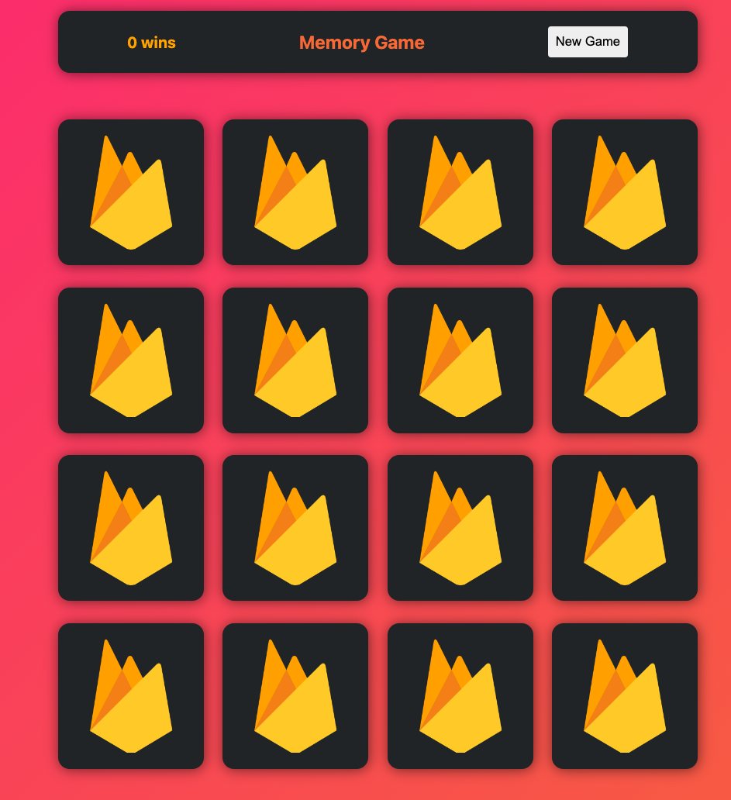

# Memory Game PWA

This is a memory game built with React. It is a PWA, so it can be installed on your device.

## How to play

The game is simple. You have to find all the pairs of cards. You can only flip two cards at a time. If the cards match, they will stay flipped. If they don't, they will flip back. The game is over when all the cards are flipped.

### Demo

Try me [here](https://react-course-46df0.web.app)!
